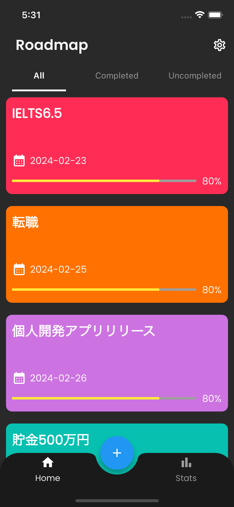
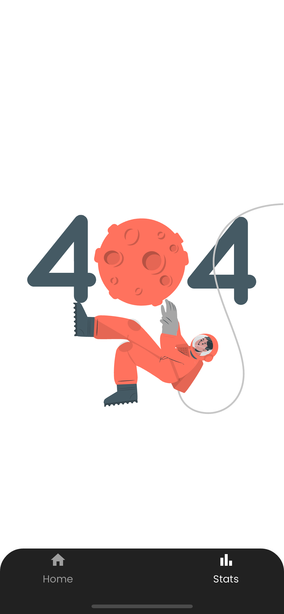
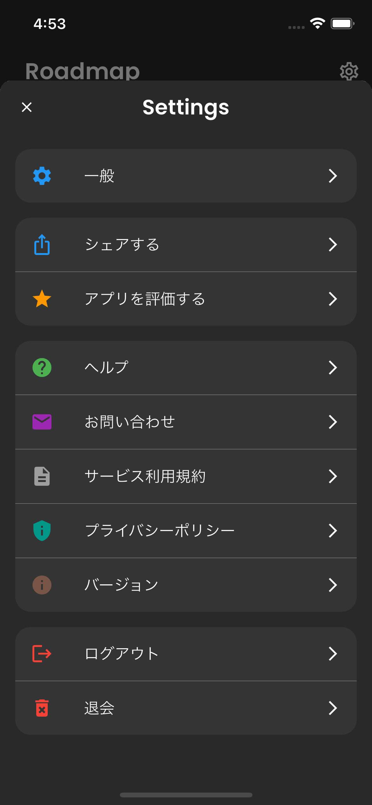

# Roadmap （実装中）

目標達成をサポートするアプリです。

このアプリを通して、Flutter開発の最適なアーキテクチャを模索し、今後のリファレンスとして活用することを目的としています。

<a href='https://apps.apple.com/jp/app/'></a>
<a href='https://play.google.com/store/apps/'></a>

## アプリデザイン

<!-- Insert design photo here -->
スプラッシュ画面|ウェルカム画面
--|--
|

ログイン画面|新規登録画面
--|--
|


ホーム画面|統計画面|設定画面
--|--|--
||

## アプリの機能

- 認証機能 ( 新規登録 / ログイン / ログアウト / アカウント削除 / Googleサインアップ )
- 目標設定 ( 追加 / 取得 / 更新 / 削除)
- ロードマップ作成 ( 進捗追跡 / 進捗率計算 )
- 視覚的表示( グラフ / アニメーション )
- 通知及びリマインダー

## 技術スタック

#### 1. フレームワーク & クラウドサービス

- [Flutter](https://flutter.dev/)
- [Firebase](https://firebase.google.com/)
  - [Authentication](https://firebase.google.com/products/auth) 
  - [Cloud Firestore](https://firebase.google.com/products/firestore)
  - [Cloud Functions](https://firebase.google.com/products/functions)
  - [Cloud Storage](https://firebase.google.com/products/storage)

#### 2. 使用パッケージ

- [hooks_riverpod](https://pub.dev/packages/hooks_riverpod) (状態管理)
- [flutter_hooks](https://pub.dev/packages/flutter_hooks)  (状態管理)
- [freezed](https://pub.dev/packages/freezed) (モデルのimmutable化)
- [go_router](https://pub.dev/packages/go_router) (画面遷移)
- [google_sign_in](https://pub.dev/packages/google_sign_in) (Googleアカウントを使用してのサインイン)
- [device_preview](https://pub.dev/packages/device_preview) (複数デバイス確認)
- [logger](https://pub.dev/packages/logger) (ログ確認)
- [pedantic_mono](https://pub.dev/packages/pedantic_mono) (静的解析)
- [flutter_launcher_icons](https://pub.dev/packages/flutter_launcher_icons) (アプリアイコンの生成)
- [flutter_native_splash](https://pub.dev/packages/flutter_native_splash) (スプラッシュ画面の生成)

#### 3. 開発の特徴

- [FVM](https://fvm.app/) を用いたFlutterのバージョン管理
- Dart-define-from-file での開発・検証・本番環境の区別
- [GitHub Actions](https://github.co.jp/features/actions) を利用したCI
- [GitHub Dependabot](https://docs.github.com/ja/code-security/dependabot) による依存関係の脆弱性監視

## アーキテクチャ / フォルダ構成

**MVVM with CleanArchitecture (+ Repositoryパターン)**

#### 1. 採用理由

MVVMとClean Architectureを組み合わせて採用しました。MVVMはUIの設計パターンであり、Clean Architectureはアプリケーション全体のアーキテクチャを形成します。この組み合わせにより、堅牢で拡張性のあるアプリケーションを実現できます。

Flutterの状態管理にはRiverpodなどのツールがあり、これらはMVVMのViewModelの役割を部分的に果たすことができます。しかし、アーキテクチャの観点から、ViewModel層を明示的に持つことでUIのロジックとビジネスロジックの疎結合を強化できると判断し、ViewModelを採用しました。

#### 2. Dependency Flow 

※ 画像準備中 

#### 3. Call Flow (関数やメソッドの呼び出しの流れ)
```
+-------------------------+
|   Presentation: View    |
+-------------------------+
        |
        V
+-------------------------+
| Presentation: ViewModel |
+-------------------------+
        |
        V
+-------------------------+
|    Domain: Use Case     |
+-------------------------+
        |
        V
+-------------------------+      +-----------------------------------------+
|    Data: Repository     |----->| Data Source: Remote for API or Firestore|
+-------------------------+      +-----------------------------------------+
```

#### 4. Data Flow (データの流れ)
```
+-------------------------+
|   Presentation: View    |
+-------------------------+
        ^
        |
+-------------------------+
| Presentation: ViewModel |
+-------------------------+
        ^
        |
+-------------------------+
|    Domain: Use Case     |
+-------------------------+
        ^
        |
+-------------------------+      +-----------------------------------------+
|    Data: Repository     |<-----| Data Source: Remote for API or Firestore|
+-------------------------+      +-----------------------------------------+
```

#### 5. フォルダ構成

Clean Architectureの原則に基づくディレクトリ構成。疎結合と再利用性を重視し、各層の独立性を高める設計。

アプリケーションの主要なビジネスルールを中心に配置し、変更の可能性が高い詳細部分を外部に置くことで、システムの柔軟性と耐久性を高めることを目的としています。リポジトリパターンはデータの取得や永続化の詳細を隠蔽し、アプリケーション全体でのデータアクセスを簡略化します。

この構成の目的は、疎結合と再利用性を高め、各層が独立して変更やテストが行いやすくすることです。

```
├── core/             // Core layer (utilities, constants, extensions)
│  ├── config/
│  ├── constants/
│  ├── di/
│  └── utils/
├── domain/           // Domain layer (Entities, Repositories, Usecases)
│  ├── entities/
│  ├── repositories/
│  └── usecases/
├── data/             // Data layer (API, Firebase, Local DB)
│  ├── datasources/
│  │   ├── local/
│  │   └── remote/
│  ├── mappers/
│  ├── models/
│  └── repositories/
├── presentation/     // Presentation layer (Views, ViewModels)                  
│  ├── routers/                
│  ├── viewmodels/
│  ├── views/
│  └── widgets/　　　　　　　　　
└── main.dart
```

## License

