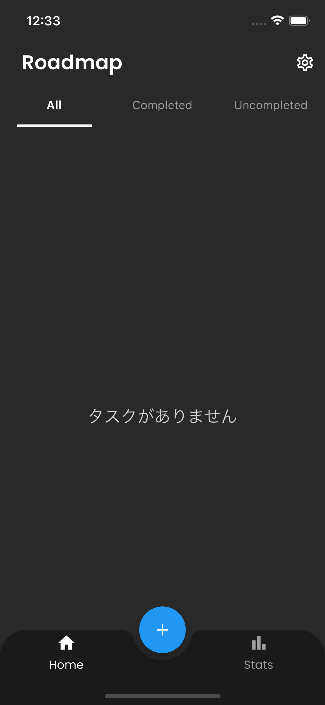

# Roadmap
This is an app to support achieving your goals.

Through this app, we aim to explore the optimal architecture for Flutter development and utilize it as a reference for future projects.

**(※ Development paused as of December 2023)**
<br>

<a href='https://apps.apple.com/jp/app/'></a>
<a href='https://play.google.com/store/apps/'></a>

## App Design
Splash Screen|Welcome Screen
--|--
|

Login Screen|Signup Screen
--|--
|

Home Screen|Empty Screen
--|--
|

Add Goal Screen|Edit Screen
--|--
|

Add Roadmap Screen|Edit Screen
--|--
|

Validation Error|Delete Screen
--|--
|

Statistics Screen|Settings Screen
--|--
|

## Demo
<table>
  <tr>
    <td><a href="https://github.com/mnengineer/roadmap/assets/126535934/77b4ab01-826c-4ddd-9d5f-a29ed438dc40" target="_blank">スプラッシュ</a></td>
    <td><a href="https://github.com/mnengineer/roadmap/assets/126535934/439490c7-3112-47f7-a9d2-a45f28e6770e" target="_blank">ログイン</a></td>
    <td><a href="https://github.com/mnengineer/roadmap/assets/126535934/8c281bf3-7af3-4714-bac1-7792e90861e6" target="_blank">ホーム</a></td>
    <td><a href="https://github.com/mnengineer/roadmap/assets/126535934/7541f466-2f00-4782-8d7d-a7bef9ab58c5" target="_blank">ログアウト</a></td>
  </tr>
</table>

## App Features
- Authentication (Sign up / Log in / Log out / Account deletion / Google Sign up)
- Goal setting (Add / Retrieve / Update / Delete)
- Roadmap creation (Progress tracking / Progress calculation)
- Visual display (Graphs / Animations)
- Notifications and reminders

## Tech Stack
#### 1. Framework & Cloud Services
- [Flutter](https://flutter.dev/)
- [Firebase](https://firebase.google.com/)
  - [Authentication](https://firebase.google.com/products/auth) 
  - [Cloud Firestore](https://firebase.google.com/products/firestore)
  - [Cloud Functions](https://firebase.google.com/products/functions)
  - [Cloud Storage](https://firebase.google.com/products/storage)

#### 2. Used Packages
- [hooks_riverpod](https://pub.dev/packages/hooks_riverpod) (State management)
- [flutter_hooks](https://pub.dev/packages/flutter_hooks)  (State management)
- [freezed](https://pub.dev/packages/freezed) (Immutable models)
- [go_router](https://pub.dev/packages/go_router) (Screen transitions)
- [google_sign_in](https://pub.dev/packages/google_sign_in) (Signing in with Google accounts)
- [device_preview](https://pub.dev/packages/device_preview) (Preview on multiple devices)
- [logger](https://pub.dev/packages/logger) (Logging)
- [pedantic_mono](https://pub.dev/packages/pedantic_mono) (Static analysis)
- [flutter_launcher_icons](https://pub.dev/packages/flutter_launcher_icons) (App icon generation)
- [flutter_native_splash](https://pub.dev/packages/flutter_native_splash) (Splash screen generation)

#### 3. Development Features
- Version management with [FVM](https://fvm.app/) 
- Environment distinction with Dart-define-from-file 
- Continuous Integration using [GitHub Actions](https://github.co.jp/features/actions)
- Dependency vulnerability monitoring with [GitHub Dependabot](https://docs.github.com/ja/code-security/dependabot)

## Architecture / Folder Structure

**MVVM with CleanArchitecture (+ Repository pattern)**

#### 1. Reasons for Adoption
We adopted a combination of MVVM and Clean Architecture. MVVM is a UI design pattern, and Clean Architecture forms the overall architecture of the application. This combination allows us to create robust and scalable applications.

For state management in Flutter, tools like Riverpod are available, which can partially fulfill the role of MVVM's ViewModel. However, from an architectural perspective, we decided to adopt ViewModel to strengthen the loose coupling between UI logic and business logic.

#### 2. Dependency Flow 
※ Image preparation in progress

#### 3. Call Flow (Function and method call flow)
```
+-------------------------+
|   Presentation: View    |
+-------------------------+
        |
        V
+-------------------------+
| Presentation: ViewModel |
+-------------------------+
        |
        V
+-------------------------+
|    Domain: Use Case     |
+-------------------------+
        |
        V
+-------------------------+      +-----------------------------------------+
|    Data: Repository     |----->| Data Source: Remote for API or Firestore|
+-------------------------+      +-----------------------------------------+
```

#### 4.Data Flow (Flow of data)
```
+-------------------------+
|   Presentation: View    |
+-------------------------+
        ^
        |
+-------------------------+
| Presentation: ViewModel |
+-------------------------+
        ^
        |
+-------------------------+
|    Domain: Use Case     |
+-------------------------+
        ^
        |
+-------------------------+      +-----------------------------------------+
|    Data: Repository     |<-----| Data Source: Remote for API or Firestore|
+-------------------------+      +-----------------------------------------+
```

#### 5.  Folder Structure
Directory structure based on the principles of Clean Architecture. Designed to prioritize loose coupling and reusability, enhancing the independence of each layer.

The main goal of this structure is to center the application's core business rules while placing the more change-prone details on the periphery. This approach enhances the system's flexibility and durability. The Repository pattern conceals the details of data retrieval and persistence, simplifying data access throughout the application.

The aim is to increase loose coupling and reusability, making it easier to make changes and test each layer independently.
```
├── core/             // Core layer (utilities, constants, extensions)
│  ├── config/
│  ├── constants/
│  ├── di/
│  └── utils/
├── domain/           // Domain layer (Entities, Repositories, Usecases)
│  ├── entities/
│  ├── repositories/
│  └── usecases/
├── data/             // Data layer (API, Firebase, Local DB)
│  ├── datasources/
│  │   ├── local/
│  │   └── remote/
│  ├── mappers/
│  ├── models/
│  └── repositories/
├── presentation/     // Presentation layer (Views, ViewModels)                  
│  ├── routers/                
│  ├── viewmodels/
│  ├── views/
│  └── widgets/　　　　　　　　　
└── main.dart
```

## License

